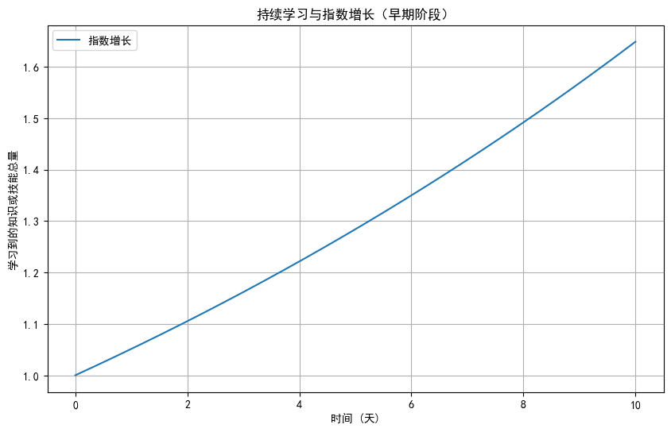
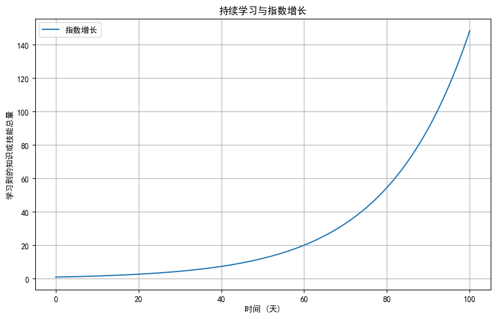
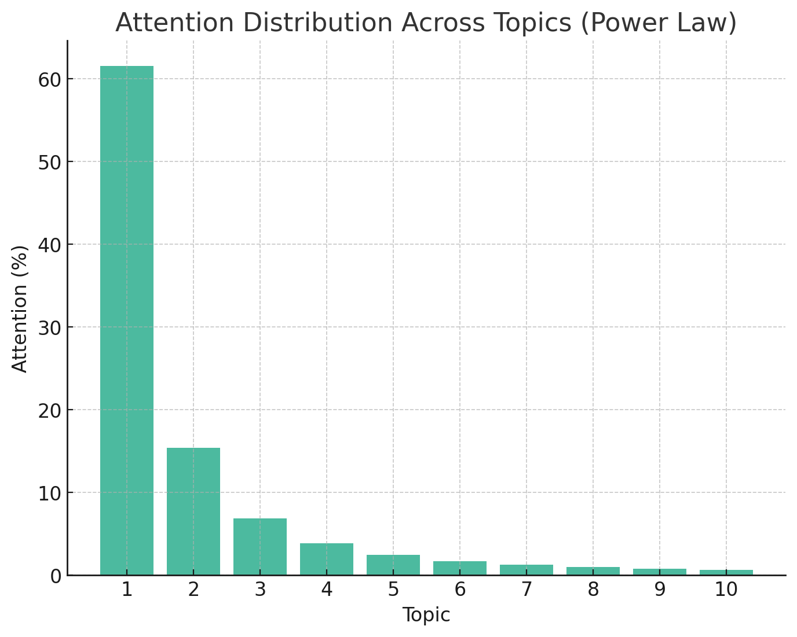
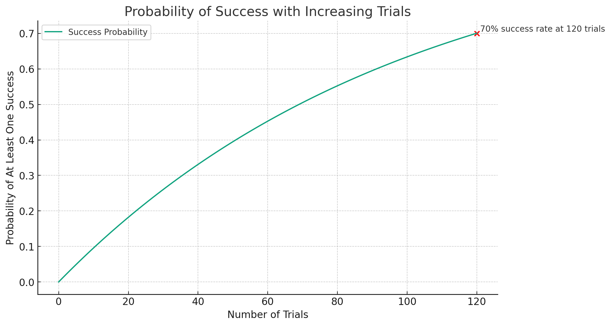

# 怎样成为一个“干大事”的人 [^great]

> 这篇文章是 YC 创始人 Paul Graham 写的。[How to Do Great Work (paulgraham.com)](http://paulgraham.com/greatwork.html)，[本仓库](https://github.com/gantrol/great-work-cn)也有[一个备份](/How_to_Do_Great_Work.md)（改了点语法错误，加上小节序号标题）
>
> 有很多相当精妙的描述，很长，但至少对有抱负的人来说，值得阅读、且希望它越长越好
>
> 而读者完全可以从中演化出无数文章，比如：
>
> - 不完美出发：为什么不应当“想好”再做
> - 不要抄袭，但可临摹
> - 一个词总结“干大事”的秘诀
>
> 手机端可考虑在[微信合集](https://mp.weixin.qq.com/mp/appmsgalbum?__biz=MzIzMzU4NDQwMg==&action=getalbum&album_id=3021333077979316229)分段阅读（无法修改，版本较老）

2023年7月 

如果你收集了各领域“干大事”技巧清单，那么它们的交集是什么呢？为了找出答案，我决定亲自整理。

我想创造一个适用于任何领域的指南，但我也很好奇交集的形状。结果显示，它确实有特定形状，而不仅仅是一个标着“努力”的点。[^shape]
后续指南会假设你非常有抱负。[^long]

## 1 要从事什么

第一步是决定要从事什么。你所选择的需要有三个标准：你有天赋、你有兴趣，并且它能“干大事”。

实际上，你不需要太担心第三个标准。在这方面，有抱负的人往往过于保守。所以你只需要找到一些你有天赋并且非常感兴趣的东西。[^1]

这听起来很简单，但通常非常困难。年轻的你不知道自己的长处，也不了解各种工作。你最终做的某些工作甚至可能还不存在。因此，尽管有些人在14岁就知道自己要想什么，大多数人还需要去探索。

确定从事什么工作的方法，就是工作。如果你不确定应该做什么，就猜。但一定要选择并行动。有些时候，你可能会猜错，但这没关系，了解多方面的事物有好处 —— 某些最大的发现来自于注意到不同领域间的联系。

养成为“自己”做项目的习惯。不要让“工作”意味着其他人告诉你该做的事。如果有一天你真“干了大事”，那很可能是在你“自己的”项目上。它可能是某个更大的项目的一部分，但会是你自驱动的那一部分。

你的项目应该是什么呢？任何能令你兴奋、激发你志向的事情都可以。随着年龄的增长和对项目的兴趣的演化，令你兴奋的和重要的事将会重合。在7岁的时候，用乐高搭建巨大的东西可能会让你觉得志得意满；然后在14岁的时候，自学微积分；到了21岁，你开始探索物理学中尚未解答的问题。（虽然事情不同，）但始终保持对事物的兴奋感。

有一种近乎痴迷的求知欲，既是“干大事”的引擎，又是方向盘[^rubber]。它不仅会推动你，如果你允许它发挥作用，它也会向你展示应该从事什么工作。

你“超级好奇”什么——好奇到让很多人厌烦？这就是你要找的。

一旦你找到了你“超级好奇”的东西，下一步就是学习足够知识，使你能够接触到知识前沿。知识的拓展方式就像地图海岸线的[^fractal]，从远处看，它的边缘看起来很平滑，而一旦你学习足够多，接近其中一个边缘，你就会发现它充满了缺口。[^new]

下一步就是注意到这些缺口。这需要一些技巧，因为大脑希望忽略这些缺口，以便构建一个更简单的世界模型。许多发现源于质疑大家以为理所当然的事情。[^2]

如果答案看起来很奇怪，那就更好了。“大事”通常有一丝奇怪。你可以从绘画跟数学领域看出这点。如果你故意搞得奇怪，那么当然会很做作，但如果它出现了，就接纳它吧。

大胆追逐那些“超纲”的想法，即便其他人对它不感兴趣——哦，改正一下，“尤其是其他人对它不感兴趣”。如果你对某种可能性感兴趣，其他人都忽视它，而你有足够的专业知识来精确说明他们忽视的是什么。那么，这将是你能找到的最好机会。[^3]

### 四个步骤

从画家到物理学家，几乎所有“干大事”的人都历经这四步：

1. 选择一个领域
2. 学习足够知识，进入前沿
3. 注意缺口
4. 探索有前途的缺口

第二步和第四步需要努力。虽然没有严格证明，但经验表明“干大事”一定要努力，就像死亡一样。这就是为什么要从事你感兴趣的：因为兴趣会驱使你，比勤奋更努力。

最强的三个动机是好奇、乐趣和渴望令人佩服。有时，它们会汇聚在一起，这种组合最强大。

“大奖”是找到所有“地图”都没有的“海岸线”[^bud]。你注意到知识表面上的一个裂缝，把它撬开，里面就是一个全新的世界。

## 2 选择困难？兴趣优先

让我们再谈谈从事什么工作这一复杂问题。这很难的主要原因是，你无法了解大部分工作，除非去做。这意味着前述四步重叠：你可能要工作数年，才能知道自己有多喜欢或擅长这项工作。而在此期间，你并没有从事大多数其他类型的工作，因此也就无法了解这些工作。因此，在最坏的情况下，根据非常不完整的信息，你可能很晚才知道怎么自己喜欢什么。[^4]

抱负的性质会加剧这个问题。抱负可分两种，一种在对该领域感兴趣之前产生，另一种从兴趣中产生。大多数“干大事”的人两种都有，但如果前者占的比例越大，那么决定做什么就越难。

大多数国家的教育系统假装这个问题很容易解决。他们期望你在你能了解它究竟是什么样子之前就致力于一个领域。因此，如果一个有抱负的人按最佳路径发展，那么系统通常会把他看做一个问题。

如果他们至少承认这一点，那会更好——承认系统不仅无法帮你弄清应该从事什么，而且它基于这个前提设计：青少年能神奇地猜中。他们不会告诉你，但我会：当涉及到事业选择时，你需要靠自己。一些人幸运地猜中了，但其他人会发现自己正横穿为所有人设计的轨道。

如果你年轻、有抱负，但不知道要从事什么，该怎么办？你不应该随波逐流，假设问题会自行解决。你需要开始行动。但没有任何系统化的步骤能让你遵循。当你读“干大事”的人的传记时，你会发现运气起了很大的作用。他们怎么发现自己的事业呢？可能是一次偶然会面，或碰巧读到一本书。所以，你需要让自己更有可能遇到好运[^big-target]，做到这一点的方法是保持求知欲。尝试许多事物，遇到许多人，阅读许多书籍，提出许多问题。[^5]

当感到疑惑时，优先选兴趣。领域随着你深入而改变。例如，数学家做的事情跟你在高中数学课上做的截然不同。因此，你需要从事不同工作，从而了解它们的特点。但是，当你越深入了解，这个领域应该越有趣。否则可能就不适合你。

不要担心自己的兴趣跟他人不同。你对一个领域的兴趣越独特，对你而言就越好。奇特的偏好往往强烈，对工作的强烈偏好意味着你将有很高的生产效率。而且，在鲜有关注的地方，你更可能找到新事物。

你适合某种工作的一个迹象是，你喜欢其他人认为乏味或恐怖的部分。

但是，领域不是人，而你没有忠于这些领域的义务。如果你工作时发现了另一个更吸引你的，不要害怕换工作。

如果你正在为人们创造某些东西，确保它是他们真正想要的。做到这一点的最好方法是制作你自己想要的东西。比如，写你想读的故事，开发你想使用的工具。你的朋友可能有类似的兴趣，这也将帮助你获得初始受众。

这应该是兴趣[^excitingness]规则的延伸。显然，你最想写的故事会是你最想读的故事。我特别提起这个的原因是，很多人都做错了。他们并没有创作他们想要的，而是尝试虚构复杂的、受众想要的东西。一旦你走上这条路，你就迷失了。[^6]

当你试图选择事业时，有很多因素让你迷失方向感：自负、时尚、恐惧、金钱、政治、他人的愿望、虚假的共识[^frauds]。但如果你坚持自己真正感兴趣的东西，你就能抵抗所有。如果你由兴趣引导，你就不会迷失。

## 3 胆量与计划

追随兴趣的策略，可能听起来相当被动，但在实践中，它通常意味着你要勇敢地越过各种障碍。你通常要冒着被拒绝和失败的风险。因此，这确实要很大胆。

虽然你需要胆量，但你通常不需要过多计划。在大多数情况下，“干大事”的秘诀很简单：在令人兴奋的“大”项目上努力工作，好事自然发生。你只需要努力保持特定因素，而不是制定一个计划然后去执行。

计划的问题在于，你首先要知道你要实现什么。你可以从小立志赢金牌或者发大财，然后不断追逐这个目标，但你不能这样发现自然选择。

我认为，对于大多数想要“干大事”的人来说，正确的策略不是过多地计划。在每个阶段，做最有趣的事情，并为未来留下最好的选择。我称这种方法为“顺势而为”[^upwind]。这是大多数“干大事”的人采取的方式。

## 4 工作避坑指南

即使你找到了令人兴奋的工作，工作起来也并非那么顺利。有时，某个新想法会让你一早人床分离，直接投入工作。但也有很多时候不是。

你一扬帆，灵感就推你前行？这不现实。就像航海一样，你会遇到逆风、潮流和暗礁，也就都要有一套技巧。

例如，虽然你必须努力工作，但可能会努力过度，如果这样，你会发现你得到的回报越来越少：疲劳会让你变蠢，最终甚至可能损害你的健康。工作产生收益递减的点取决于工作的类型。最艰难的那些，你可能一天只能做四到五个小时。

理想情况下，这些工作时段应该连续。因此，尽可能安排生活，为工作留出大块的时间。如果你知道你可能会被打断，你会回避困难的任务。

开始工作可能比继续工作更难。你经常需要骗自己，以便越过那道坎。不要为此担忧，这是工作的性质，而不是你性格上的缺陷。工作有一种激活能量，既有每天的，也有每个项目的。而且，那道坎是假的（它比保持工作所需的能量高），为了越过它，用一个同等程度的谎言骗自己，没有问题。[^just-one]

如果你想“干大事”，自我欺骗通常不对，但这是罕见的例外。当我在早晨不愿意开始工作的时候，我常常骗自己说：“我就看看做到哪了。”五分钟后，我发现了一些看起来错误或不完整的地方，然后就停不下来了。

类似的技巧对于启动新项目也有效。比如，骗自己说，某个项目投入没那么大 —— 很多“大事”，始于“这没多难吧？”

这是年轻人具有的一个优势。他们更乐观，尽管他们乐观的部分源于无知，但在这种情况下，无知胜有知。

已启动的事情，即使比你预期的工作量要大，你也要尽量完成。把事做完不仅能锻炼有序性或自律性。在许多项目中，很多最棒的工作发生在最后阶段。

另一个可许的谎言是夸大你正在做的事情的重要性，至少你这样认为。如果这有助于你发现新事物，那么“谎言”成真。[^7]

## 5 拖延，勤奋地拖延

因为开始工作有两种含义 —— 每天的和每个项目的，所以也有两种形式的拖延。项目级拖延远比每日拖延更为危险。因为时机还不够成熟，你年复一年地推迟那个高目标项目。当你以年为单位去拖延时，你可能会错过很多事情。[^8]

项目级拖延常常会伪装成工作，这是它如此危险的一个原因 —— 你并不是坐在那里什么也不做；你正勤奋地做其他的事情。所以项目级拖延不会触发每日拖延警报 —— 你太忙了，以至于不会注意到它。

解决它的方式是偶尔停下来问问自己：“我在做最想做的事情吗？”当你还年轻，如果答案偶尔是“否”，那也没关系，但随着年龄增长，危害也越来越严重。[^9]

## 6 持续：聚沙成塔，指数增长

大多数人无法接受，“大事”通常需要在问题上投入大量时间。你不能视这段时间为成本，否则它会看起来太高。你必须在事情中找到足够的乐趣。

可能有一些工作，迫使你在讨厌的事情上辛勤劳作好几年，才能找到乐趣，但“大事”并非如此。“大事”是通过持续专注于你真正感兴趣的事情来实现的。当你停下来复盘，你会惊讶于你走了多远。

惊讶的原因是低估了工作的累积效果。每天写一页看起来不算什么，但如果你每天都这样做，你每年就会写一本书。这就是关键：**持续**。“干大事”的人不是每天都做很多事情。他们做了一些事情，而不是什么都不做。

如果你做的工作能产生复利，你将有指数级增长。大多数这样做的人都是在无意识的情况下做的，但这值得我们停下来思考。一个例子是学习：你对某件事情了解得越多，学习更多的东西就越容易。另一个例子是扩大受众群：你拥有的粉丝越多，他们会给你带来更多的新粉丝。

指数增长的问题在于，在一开始，感觉曲线平滑。实际上并非如此，它依然是一个美妙的指数曲线。但我们无法直观地理解这一点，以致于在早期阶段低估了指数增长。[^exp]

指数增长的事物可以变得如此有价值，以至于值得我们做出特殊的努力来启动它。但因为我们在早期阶段低估了指数增长，所以这主要还是在无意识中完成的：人们之所以能通过在学习新东西的、没有回报的最初阶段，是因为他们从经验中领会到，学习新东西总是需要一个最初推动力；或者他们之所以一次吸引一个粉丝，是因为他们没有更好的做法。如果人们意识到他们可以投资于指数增长，会有更多的人去做这件事。

## 7 “专注-放松”循环，全程避免分心[^tomato]

工作不仅发生在“做”的时候。你在走路、洗澡或睡觉时，会有一种发散性思考，这种思考可以非常强效[^undirected]。通过稍微走神，你经常能解决无法专心解决的问题。

然而，要从这种现象中受益，你必须在正常地努力工作。你不能只是白日梦游。白日梦必须跟努力工作交替，而这工作要将问题喂给白日梦。[^10]

众所周知，工作时要避免分心，但在走神时也要。两者同样重要。当你走神时，你的思绪会漫游到你在那个时刻最在乎的事情。所以避免那种能把你的工作挤出首位的消遣，否则你会把这种有价值的思考方式浪费在这种消遣上。（例外：不要避免爱情。）

## 8 力求最佳比变得更好简单

在你的领域中，有意识地去培养你对工作品质的判断力。在你明白哪个是最佳，并理解其背后原因之前，你不会知道你的目标是什么。

而力求最佳**就是**你的目标。因为如果你不去尝试成为最佳，你甚至无法变得更好。许多领域的很多人都观察到了这个现象，这可能值得我们深思其中原因：

- 可能是，对于抱负来说，几乎所有错误都会使你离目标更远 —— 几乎所有偏离目标的炮弹都是差了一点；
- 可能是，想要成为最佳的抱负，跟只是想要变得更好，在质量上有差异；
- 也可能是，仅仅变得更好，是一个过于模糊的标准。

可能这三点都正确。[^11]

幸运的是，这里存在一种规模经济效应。尽管你可能觉得努力成为最佳会带来沉重的负担，但在实际操作中，你往往会得到更多的收益。这是令人兴奋的，也是奇怪得无拘束的。它简化了事情。在某些方面，试图成为最佳比仅仅试图变得更好更容易。[^10x]

追求高目标的一种方式是尝试去做一些在一百年后人们仍会关心的事情。并非因为他们的观点比你的同时代人更重要，而是因为那些在一百年后仍然被认为好的事情，更有可能真正地好。

## 9 避免做作：成名与特立独行

不要想着以一种特立独行的风格做事。你只需尽力做好自己能做的工作 —— 你将无法避免与众不同。

风格是不刻意追求的、独特的行事方式。刻意只会做作。

做作实际上就是扮作其他人做事，而不是你自己。你采用了一个令人印象深刻但虚假的外衣，虽然你对这种令人印象深刻的外衣感到满意，但做事时会露馅。[^12]

对年轻人来说，成为别人的诱惑最大。他们常常觉得自己是无名小卒。但你永远不需要担心这个问题，因为如果你手头的项目足够有抱负，这个问题就会迎刃而解。如果你在一个“大”项目上取得成功，你就不是无名小卒 —— 你就是那个 “干大事”的人。因此，专心办事，而身份问题自解。

## 10 诚挚与书呆子

就目前而言，“避免做作”这一规则有用但消极，但有没有规则更积极呢？也就是说，你会如何描述应该怎样，而不是“避免”什么？最佳答案是诚挚。如果你诚挚，你不仅能避免做作，而且能避免一系列类似恶习。

诚挚的核心是智识上诚实。我们在孩提时期被教导要诚实，把诚实看作是一种无私美德——一种牺牲。但实际上，它也是一种力量源泉。为了发现新想法，你需要对事实异常敏锐。你要尝试发现别人至今还未发现的事实。如果你在智识上不诚实，又怎能对事实有敏锐目光呢？

如何避免智识上不诚实？一种方式是保持轻微而正向的压力。愿意积极承认错误。一旦你承认了错误，你就会从压力解脱；而在那之前，你必须承担它。[^13]

诚挚还有另一个更微妙的成分：不拘泥形式。不拘泥形式比其语法上否定的名词所暗示的要重要得多。它不仅仅缺少某种东西。它意味着专注于要事，而不是相反。

形式和做作有一个共同之处，那就是在完成工作的同时，你还试图表现出某种方式。但是，任何投入到你表现方式的能量都会削弱你的优秀表现。这就是为什么书呆子在“干大事”时有优势：他们不在表现上费力。事实上，这基本上就是书呆子的定义。

书呆子有一种无邪的大胆，这正是你在“干大事”时所需要的。这种大胆不是后天学来的，而是从童年时代保留下来的。所以，保持住。成为那个做事的人，而不是坐在一旁，提出批评，显得很有深度的样子。“批评很容易”显然正确，而“干大事”的路上不存在容易。

可能有一些工作，在这些工作中，愤世嫉俗和悲观有优势，但是如果你想“干大事”，乐观有优势，尽管有时候会被当做傻瓜。虽然《旧约全书》说，最好保持安静，以免被当傻瓜[^fool]，但这是为了**看起来**聪明的建议，而如果你真的想发现新事物，最好冒着这个风险，告诉人们你的想法。

有些人天生就诚挚，而另一些人需要有意努力。这些都行。但我怀疑，如果不诚挚，就不可能“干大事”。不诚挚太难了——你没有容错的余地，来应对做作、智识上不诚实、遵循惯例、追求时尚或者酷。[^14]

## 11 一致、优雅与真实

“大事”不仅要跟创作者的特征保持一致，“大事”本身也表现出一致性 —— “大事”通常都是一个整体。因此，如果你做事时面临决策，看看哪个选择更有持续性。

为了一致性，你可能需要丢弃并重做一些东西。你不一定非得这样做，但你必须愿意这样做，而这可能要费一些精力。由于现状偏见[^quo]和懒惰的联合影响，你会反对重做，即便你确实需要。为了克服这种情况，问问自己：如果我已经做出了那个改变，我还想回到现在这样吗？

有信心去删减。不要仅仅因为你为它感到自豪，或者它花费了你大量精力，就保留不适合的东西。

删减，直到只剩下本质。对于某些事儿，这样确实不错：

- 结果将更加集中；
- 你会更好地理解它；
- 你不能通过欺骗自己，来否认其中实质。

数学的优雅听起来像从艺术中借来的隐喻。当第一次听到“优雅”一词被用来形容证明时，我就这么想。但现在我怀疑，在概念上，数学的优雅比艺术的优先——艺术优雅的主要成分是数学的优雅。无论如何，它是一个超越数学之外的有用的标准。

然而，优雅可能是一种对未来的投资。费力的解决方案在短期内通常会有更高的声望。它们花费大量劳力并且难以理解，这两点都至少暂时地让人印象深刻。

而其中一些最出色的事，仿佛不那么费劲，因为在某种意义上它已经在那了。它不需要被构建，只需要被发现。当你很难判断你在创造还是发现时，这个迹象非常好。

当你在做的事情可以被看作是创造或发现时，偏向于发现。试着想象自己只是一个管道，通过这个管道，想法可以自然形成。

（奇怪的是，一个例外是选择要研究的问题。这通常被看作是搜索，但在最好的情况下，它更像是创造。在最好的情况下，你在探索过程中创造了这个领域。）

同样，如果你正在尝试构建一个强大的工具，应当让它具有最大的自由度。即便你不知道会有什么好处，强大的工具肯定会被用于你意想不到的地方，因此倾向于消除限制。

“大事”往往在某种意义上像工具，别人可以基于它来构建。所以，如果你正在创造其他人可以使用的想法，或者提出其他人可以回答的问题，那么这是一个好迹象。最好的想法会影响许多不同的领域。

如果你以最普遍的形式表达你的思想，它们将比你所预期的更真实。

## 12 原创，怎样产生新想法

当然，仅仅真实还不够。好想法必须真实且新颖。即使你已经学习到足够多知识，走到知识前沿，仍需要一定能力来发现新想法。

在英语中，我们给这种能力取名为原创性、创造性和想象力。单独给它取一个名字似乎合理，因为它在某种程度上确实是一种独立技能。你可以在其他方面具有大量能力——所谓“技术能力”——但在这一方面可能没有多少。

我一直不喜欢“创造性过程”这个词。它似乎有些误导人。原创性不是一个过程，而是一种思维习惯。原创思考者会关注任何事物并产生新想法，就像角磨机[^grinder]抛出火花一样。他们不能控制自己。

 

如果他们不太理解他们关注的东西，这些新想法可能并不好。我认识一位男性思考者，他在离婚后决定花心思在约会上。他很有原创性，但他对约会的了解大概跟十五岁小孩一样，而约会结果“引人注目、丰富多彩”[^colorful]。看到原创性如此跟专业技能脱钩，其本质则更为清晰。

我不知道是否可以培养原创性，但肯定可以充分利用你现有的。例如，当你在钻研时，你更有可能产生原创想法。原创想法不能光靠想来产生，而是要靠构建或理解有点太难的东西。[^15]

一种产生新想法的好方法是，谈谈或写写你感兴趣的事物。当你试图将想法转化为词语，其中缺失的想法会形成一种真空[^vaccum]，从而吸引你去表达。事实上，某一种思考只能通过写作来完成。

改变环境可以帮助你。如果你参观一个新地方，你会发现自己在那里有新想法。旅行本身常常会激发它们。但你可能不需要走太远就可以获得这个好处。有时候，散步就足够了。[^16]

在主题空间中旅行也有帮助。如果你探索许多不同主题，你将有更多新想法，部分原因是这为灵感角磨机提供了更多表面[^grinder]，部分原因是类比能产生很多新想法。

不过，不要在许多主题上**均匀**分配注意力，否则会把精力分得太薄。你需要按照更像幂律分布来分配。[^17] 专业地在少数几个主题求知，随意地在许多其他主题求知。

求知欲和原创性密切相关。求知欲通过提供新事物来滋养原创性。但关系比这更近。求知欲本身就是一种原创性；大体而言，求知欲像是问题，而原创性就像是答案。而且，在最好的情况下，问题是答案的重要组成部分，那么求知欲就是一种原创力。

## 13 发现、打破并修复模型

新想法通常由你眼前的事物构成，这会带来一种怪现象：一旦你看到了一个新想法，它就会很明显。疑问也随之而来，为什么之前没有人想到呢？

如果一个想法既显得新颖又显而易见，那么它很可能是个好想法。

看到某个显眼的东西，听起来很容易。然而，从经验上看，很难抓住新想法。为什么如此矛盾？因为抓住新想法通常需要你改变看世界的方式。我们通过模型来看世界，这些模型既帮助我们、也约束我们。当你修复有误模型时，新想法就变得明显。但是，很难发现并修复有误模型。这就是新想法既显而易见又难以发现的原因：你要历经困难，才容易看到它们。

一种发现有误模型的方式是，比其他人更严谨。线索藏在世界模型与现实冲突之处。大多数人不愿意看到这些线索。是他们依赖现有模型吗？这样说得太轻了，他们就是这样思考的，他们倾向于忽视这些线索，无论这些线索在复盘中看起来有多么明显。

要找到新想法，你必须抓住出错的线索，而不是回避。爱因斯坦就这么做了，他能看到麦克斯韦方程隐含推论，并不是因为他在寻找新想法，而是因为他更严谨。

你还要愿意打破规则。尽管听起来很矛盾，愿意打破规则，会给你修复模型提供帮助。在旧模型看来，新模型通常会打破一些规则、至少是隐含规则，而这旧模型，大家（包括你）起初都在使用。

很少有人理解修复模型有多需要打破规则，因为一旦新想法成功，它们看起来就会更合乎规则。一旦你使用了新世界模型，它们似乎完全合理[^reasonable]。但是在打破之时不是。例如，即使在天文学家中，也花了一大半世纪来接受地心说模型，因为它太不对劲了。

如果你仔细思考，那么你会发现，对大多数人来说，一个好的新想法都必须看起来很糟糕，否则早已有人做过了。你要找的是那些看起来疯狂，但正确地疯狂的想法。你怎么分辨呢？你不能确定。通常，看起来坏的想法内外如一，让人沮丧。但看起来坏、而正确地疯狂的富有深意，让人兴奋。

有两种方式可舒适地打破规则：喜欢打破它们，对它们漠不关心。我称这两种情况为积极和消极独立思维。

淘气鬼们具备积极独立思维。规则不仅无法阻止他们，打破规则还会给他们额外能量。对于这种人来说，大胆创新的快乐，有时足以作为激活能量，来启动它对应的项目。

另一种方式是不关心它们，或者甚至不知道它们存在。这就是为什么新手和外行人经常能够发现新东西 —— 他们不了解一个领域假设，就像临时具备被动独立思维。亚斯伯格症候群患者似乎也免疫常识。我认识的几个亚斯伯格症候群患者说，这帮助他们有新想法。

严谨跟打破规则像是一个奇怪的组合。在主流文化中，它们对立。但在这方面，主流文化的模型有误。它隐含地假设了问题微不足道，而在微不足道的问题中，严谨和打破规则对立。但在真正重要的问题中，只有打破规则的人才能真正严谨。

## 14 被忽视的想法

一个想法通常在进入意识前才会被忽视。你确实在潜意识中看到它，但是你的另一部分潜意识将其击败，因为它可能会太奇怪、太冒险、太辛苦、太有争议。这暗示了一种令人兴奋的可能：如果你能不过滤它们，你就能看到更多新想法。

一种方法是，询问对**其他人**来说，什么想法值得探索。然后潜意识就不会为了保护你而排除它们。

你也可以研究另一个方法：从遮挡物开始。有些原则被珍视却错误，在它们周围，都有一片盲区，盲区里充斥着有价值的想法。因为它们跟某个原则相矛盾，所以未被探索。

宗教是原则集合，这些原则被珍视但错误。不论是字面或比喻上的宗教，它们周围的盲区中有未被探索的有价值的想法。哥白尼和达尔文都发现了这种想法。[^18]

在你的领域中，人们将什么原则视为教条，认为他们不言自明，而实际上可能并非如此？如果你丢掉它，又有什么变得可能呢？

## 15 关键：决定要做什么

人们在解决问题上，比选择问题更有创意。即便是最聪明的人，在选择问题上也会出人意料得保守。而某些人怎样都不会梦想追逐潮流，却被卷入到解决“流行”问题上。

人们在选择问题时比解决方案时更保守。一个原因是选择问题需要更多投入。一个问题可能占用你好几年的时间，而探索一个解决方案可能只需要几天。但即便如此，我认为大多数人还是太保守了。他们不仅是在应对风险，而且也在应对主流。非“流行”问题被低估了。

一种非“流行”问题非常有趣，人们认为已经充分探索过这些问题，但实际上没有。“大事”往往依赖现有事物，并展现其潜力。杜勒尔和瓦特都做到了这一点。人们经常对此有错误认识。如果你对某些领域感兴趣，不要只因为这种错误认识，而放弃研究。

一个非“流行”问题可以非常让人愉悦。没有炒作或匆忙。机会主义者和批评家都在别处忙碌。现有工作往往如老派般坚固。并且，培育原本被浪费的想法时，感觉更经济利用了资源。

但是，最常见的被忽视的问题，并非完全不“流行”。它只是似乎没有它实际上那么重要。你如何找到这些问题呢？通过“自我放纵”——释放求知欲，并至少暂时屏蔽掉脑海中说「关注“重要”问题」的小声音，让求知欲引导你。

你确实需要解决重要问题，但在什么算作重要问题上，几乎每个人都太保守了。而且，如果你周围有一个重要问题，但它被忽视了，那么它可能已经在潜意识雷达上。所以，尝试问问自己：如果你要从“严肃”工作中抽身出来，你会研究什么貌似有趣的事情？答案可能比想象中更重要。

选择问题似乎比解决问题上更具独创性。这种独创性能用来区分人是否发现一个新领域。所以，看起来仅仅是第一步「决定要做什么」，在某种意义上是整个游戏的关键。

## 16 问题藏答案

很少有人理解选择问题有多关键。其中一个原因是误解了问题跟答案的比例。人们认为好想法都在答案里，但真洞见往往在问题中。

另一个原因是学校里用问题的方式。在学校里，问题往往只存在一段很短的时间，然后就得到了答案。在这里，问题就像不稳定粒子，但是一个真正好的问题可以远不止于此。一个真正好的问题就是发现的一部分。新物种如何产生？使物体落向地面的力和使行星保持在轨道上的力一样吗？仅仅提出这样的问题，你就已经进入了令人兴奋的新领域。

你身边未回答的问题可能会成为不舒服的东西。但你身边的问题越多，发现解决方案的机会就越大——或者可能更让人兴奋的是，发现两个未解决的问题等价。

有时候，你很长时间都有同一个问题。“大事”往往来自于回到你在几年前，甚至在童年就注意到的一个问题，并且不能停止思考。人们经常谈论保持你年轻时的梦想的重要性，但保持你年轻时的问题同样重要。[^19]

专业知识跟公众看法极不相同。公众看来，专家十分有把握。但实际上，你越疑惑越好，只要这事重要，并且其他人也不理解它们。

试想，发现新想法那一刻之前会发生什么。一般是有足够专业知识的人对某件事感到疑惑。这意味着独创性就包括疑惑 —— 也就是不确定！这世间充满谜团，你必须适应，你要愿意去看到它们，但也不能适应到不想解决它们。[^20]

拥有大量未解答的问题是一件极好的事。这是一种让富有问题的人获得更多问题的情景，因为获取新问题的最好方法是尝试回答现有问题。问题不仅引导我们找到答案，还引导我们找到更多问题。

## 17 多拉“线头”，小事起步，快速迭代

最好的问题会在回答中生长。问题就像线头，一开始不会很长，但你要是去拉它，会发现它会变得越来越长[^thread]。所以，在你尝试回答某个问题之前，不要期望它就显得很长。你很少能预测到它能多长，甚至连注意到这个线头都已经足够困难了，更不用说预测你能把它拉得多长。

最好是混杂地求知 —— 轻轻地拉动很多线头，看看会发生什么。大事从小事开始。大事一开始往往只是实验、业余项目、或者演讲，然后慢慢发展壮大。所以，开始做很多小事情。

做事的广度被低估了。你尝试的事情越多样，发现新事物的机会就越大。然而，你需要明白，尝试很多事情，就意味着会有很多事情没效果。你不能有着很多好主意，同时没有很多坏主意。[^21]

从头研究已经完成的所有事情，尽管听起来要承担很多工作，但这样你会学得更快，也会更有乐趣。当你真正去看先前工作时，你会有更深的理解。所以，选这条路开始吧；一开始容易些，因为开始意味着从小事做起。这两个想法就像两块拼图一样，完美契合。

为了“干大事”，你要怎样从小事做起呢？通过发布连续版本。“大事”几乎总要靠连续版本来完成。你开发出一个小东西，然后让它逐步演化，最终版本会比所有计划版本都更聪明和有抱负。

当你为人们制作东西时，这一策略十分有效 —— 快速地把初始版本放在他们面前，然后根据反馈调整。

首先，尝试可能会成功的最简单的事情。出人意料的是，它经常会成功。就算不成功，至少会让你启动。

不要试图在任何一个版本中塞入太多新东西。对于第一版[^first]和第二版[^second]的这种做法有专门的名词，但这些都只是这个原则的实例。

一个新项目的早期版本有时会被贬低为玩具。这是个好兆头。那意味着，除了规模,它具有新想法的所有特性，而规模往往会随之而来。[^22]

除了“小事起步，快速迭代”，你还能选择提前计划。而选择计划看起来更负责任。说“我们第一步是……；第二步是……；最后是……”听起来比“我们先做完第一步，然后看看会发生什么”更有条理。它确实更有条理，只是效果不太好而已。

计划本身并不好。它有时必要，但只是因为没有更好的选择 —— 容错率低，你不得不这样做。可能是因为你在使用不灵活的媒介，或者需要协调很多人力[^evil]。如果你能把项目保持小而且使用灵活的媒介，你就不需要做太多计划，你的设计可以迭代演进。

## 18 风险与失败

尽可能承担风险。在一个高效市场，风险跟回报成正比，所以不要寻求确定性，而是期望行动。如果你不偶尔失败，你可能过于保守了。

尽管保守主义通常跟老年人相关联，但年轻人更容易犯这个错误。经验不足让他们害怕风险，但当你年轻时，你能承受最多风险。

即使一个项目失败了，也可以有价值。在项目中，你将会经历少有人见过的领域，遇到少有人问过的问题。最好的问题来源，可能是做一些稍微有点困难的事情。

## 19 发挥年轻的优势

当你有年轻的优势时，利用它们，当你有年长的优势时，利用它们。年轻的优势是精力、时间、乐观和自由。年长的优势是知识、效率、金钱和权力。你可以在年轻时获取一些后者，并在老年时保留一些前者。

年长者往往知道他们拥有哪些优势。年轻人往往不知道自己拥有这些优势。其中最可能是时间。年轻人不知道他们在时间上有多么富有。最好的利用时间优势的方法是，以稍微“虚度”的方式来使用它：出于好奇，学习一些你不需要知道的东西，也许只是因为它很酷，也许只是想尝试去建造一些东西，也许只是想在某件事上变得极其出色。

这里的“稍微”是一个重要的修饰词。当你年轻的时候，大方地花费时间，但不要简单地浪费。做一些你担心可能是浪费时间的事情[^waste]，和做一些你确定会浪费时间的事情之间有很大的区别。前者至少能成为一种投资，而且可能比你想象的要好。[^23]

年轻人最微妙的优势，或者更准确地说是无经验的优势，是你以全新的眼光看待一切。当你第一次接纳一个观点，有时两者并不完全契合。通常问题出在你身上，但有时候问题出在观点上。它的一部分突出来，十分别扭，当你思考它时，还会刺到你。习惯了这个想法的人已经学会忽略它，但你有机会不这样做。[^24]

所以当你第一次学习某件事时，要注意那些看起来错误或缺失的事情。你会被诱导去忽略它们，因为问题99%出在你身上。为了继续前进，你可能需要暂时放下你的疑虑。但是不要忘记它们。当你更深入地研究这个主题时，回来检查问题是否还在。如果它们在你现在的知识下仍然可行，那么它们可能代表一个未被发现的想法。

## 20 清除学校教你的“废料”

知道你**不**需要担心什么，是你从经验中获得的极有价值的知识。年轻人知道所有可能重要的事情，但不知道如何给它们的重要性排序。所以他们对所有的事情都同样担忧，但他们应该更关注一些事情，而对其余的事情几乎不用担心。

但这在经验不足的问题中只占其中一半。另一半是你所知道的那些不对的事情。你带着满身“废料”（恶习愚行或错误观念）成年，在你清除掉“废料”之前，至少在你想做的事路上的，你无法“干大事”。

学校留下在你身上留下的许多“废料”。我们如此习惯于学校，以至于我们下意识地将上学等同于学习，但实际上学校有各种奇怪的能力，扭曲了我们对学习和思考的观念。

例如，学校会诱导你变得被动。当你还小，就有一个权威在班级前面告诉你们所有人需要学什么，然后衡量你们是否做到了。但课堂和测试并不是学习的固有部分；它们只是学校通常设计方式的产物。

你越早克服这种被动，越好。如果你还在上学，试着把你的教育视为你的项目，还有，你的老师为你工作，而不是反过来。这可能看起来有点牵强，但这不仅仅是一种奇怪的思想实验。从经济上考虑，这就是事实，且在最好的情况下，它在智力上也是事实。最好的老师不想成为你的老板。他们更希望你能奋力前行，咨询他们，而不是被他们填满材料。

学校还会给你一个误导，让你认为工作就是这样。在学校里，他们告诉你问题是什么，几乎总是可以用你目前所学知识来解决。在现实生活中，你必须找出问题是什么，而你通常不知道它们是否可以解决。

学校做的最坏的事，也许是训练你“骇入”考试的高分技巧[^hacking]。你不能通过这种方式“干大事”。你不能欺骗规律。所以停止寻找那种捷径。对抗系统的方法是关注其他人忽视的问题和解决方案，而不是在工作本身上敷衍了事。

## 21 假如有人给你机会就好了？

如果某个贵人能给你一个“大机会”就好了？不要这样想。即使它可能实现，得到它的最好方式也是专注于做事，而不是追逐贵人。

也不要把委员会的拒绝放在心上。打动招生官和奖金评选委员会的品质跟“干大事”所需的大不相同。只有参与“干大事”反馈循环时，评选委员会的决定才有意义[^loop]，然而委员会很少参与。

## 22 临摹：平衡学习与创新

领域新手经常会临摹[^copy]现有工作。这本质上没有坏处。对于学习运作某件事，没有方式比尝试临摹更好。临摹也不一定会使工作失去原创性。原创性带来新想法，但不意味着缺乏旧想法。

有好临摹，也有坏临摹。如果你要临摹，那就公开地做，而不是秘密地做，更不用说无意识地做了。名句“伟大的艺术家剽窃”就是这个意思，它被广泛误解了。无意识地临摹危害无穷，还给临摹带来坏名声。那就像一辆火车，行驶在别人铺设的轨道上。但如果公开地做，临摹代表更优，而不是从属。[^25]

在许多领域，早期工作几乎不可避免地会在某种程度上基于他人作品。工程很少凭空产生。它们通常受先前作品启发。当你刚开始时，你没有作品；如果你处理某件事，那只好用他人作品。一旦你站稳脚跟，你就可以受自己作品启发。虽然前者被称为衍生物，而后者不会，但从结构上看，两种情况很相似。

有时，新奇性反而让想法看上去没那么新奇。新发现往往要先被视为现有事物的变种，**甚至发现者也要这样**，因为还没有概念词汇来表达这些发现。

尽管如此，临摹确实有一些危害。其中一个是你往往会临摹旧东西——虽然它们曾在知识前沿，但现在不再是。

当你临摹一样东西时，不要临摹每一个特征。如果你临摹某些特征，会让你看起来很可笑。例如，如果你18岁，不要模仿一位50岁著名教授的行为，或者模仿几百年前文艺复兴诗歌的风格。

你所崇拜的事物的一些特征反而是它们的缺点，但这不影响它们成功。实际上，最容易模仿的特征最有可能是缺点。

这在行为上尤其如此。一些有才华的人是混蛋，这有时会使毫无经验的人以为做混蛋是变得才华的一部分。但事实并非如此；变得有才华只是他们不受处罚的方式。

有一种极其强效的临摹，就是将一种东西从一个领域临摹到另一个领域。历史上这种偶然发现是如此之多，以致于可能值得有意地学习其他类型的工作，从而给这种偶然更多机会。如果你让它们成为隐喻，你可以从相当远的领域取得想法。

负面的例子可能和积极的一样鼓舞人心。事实上，比起做得好的事情，你有时可以从做得不好的事情中学到更多；有时只有在失去时才能明白需要什么。

## 23 找找“干大事”的人

如果你所在领域的最佳人才都集中在一个地方，那么花一段时间去那里考察，是一个不错的主意。这会提升你的抱负，并且，你会发现这些人都是普通人，从而增强你的自信心。

如果你真诚，你可能会得到比你预期更热烈的欢迎。大多数擅长某事的人都愿意跟真正感兴趣的人谈论这件事。如果他们真的擅长他们的工作，那么他们可能有这方面的嗜好，而嗜好会让他们谈论这方面的话题。

不过，找到真正优秀的人可能需要一些努力。“干大事”有如此威望，以至于在一些地方，特别是大学，有一种优雅的说辞，即每个人都在从事这种工作。而这离事实差远了。大学内部的人不能公开说这样的话，但不同部门完成的工作质量有着巨大的差异。有些部门的人做出了“大事”；有些部门曾做过；有些部门还从未做过。

## 24 要寻找最好的同事

寻找最好的同事。有很多项目无法独立完成，即使你可以独立完成项目，其他人也能给你鼓励、跟你交换想法。

同事不仅会影响你的工作，他们也会影响你。所以和你想成为的人一起工作，因为你会变得像他们。

在同事中，质量比数量更重要。有一两个杰出的同事比拥有一栋楼的好同事要好。实际上，根据历史来看，这不仅仅是更好，而且必需：“大事”在群体中发生的程度表明，同事往往决定了“干大事”与否。

你如何知道你有杰出的同事呢？根据我的经验，当你有时，你会知道。这意味着如果你不确定，你可能没有。但也许有可能给出一个更具体的答案。以下试着回答：足够好的同事提供**令人惊讶**的见解。他们可以看到和做你无法做的事情。所以，如果你有少数几个足够好的同事，可以让你有这样的感觉，你可能就有杰出的同事了。

大多数人可以从合作中受益，但有些项目需要更大规模的人力，不是每个人都适合启动这样的项目。如果你想运行这样的项目，你将必须成为一个管理者，而优秀的管理能力需要像任何其他工作一样的才能和兴趣。如果你没有这些，那么只有两种选择：强迫自己将管理作为第二语言来学习，或者避开这样的项目。

## 25 斗志

珍视你的斗志。当你在从事“大”项目时，这是一切的基础。你必须像抚育和保护一个活的生物一样来培养和保护它。

斗志源于从你对生活的看法。如果你是个乐观主义者，你更有可能做出伟大的工作，如果你认为自己幸运，而不认为自己是受害者，那你就更有可能做出伟大的工作。

的确，工作在某种程度上可以让你免受问题困扰。如果你选择的工作是纯粹的，恰恰是它的困难会成为你远离日常生活的困难的庇护所。如果这是逃避，那它就是一种非常有生产力的逃避形式，也是历史上一些最伟大的思考者所使用的。

斗志通过工作积累：高昂的斗志帮助你做好工作，这又增强了你的斗志，帮助你做得更好。但是这个循环也可以向另一个方向运行：如果你没有做好工作，那可能会使你斗志低落，使你更难做好。因为这个循环在正确的方向上运行非常重要，所以当你卡住的时候转向更容易的工作可能是个好主意，就这样你开始有所作为。

有抱负的人犯的一类极大的错误，是允许挫折一下子摧毁他们的斗志，就像气球突然破裂。你可以通过明确地把挫折看作是你的过程的一部分来免疫这种情况。解决难题总是会涉及到一些反复。

做出伟大的工作是一种深度优先搜索，其根节点是渴望去做。所以"如果一开始你没有成功，再试一试"并不完全正确。它应该是：如果一开始你没有成功，要么再试一次，要么回溯然后再试一次。

"永不放弃"也并不完全正确。显然，有时候放弃是正确的选择。更准确的版本应该是：永远不要让挫折让你恐慌，以至于你需要回溯。推论：永远不要放弃根节点。

如果工作需要尽力去做，那并不一定是坏事，就像跑步时喘不过气来并不一定是坏事。这取决于你跑得多快。所以学会区分好的痛苦和坏的痛苦。好的痛苦是努力的标志；坏的痛苦是伤害的标志。

## 26 斗志的影响因素

[//]: # (TODO: 专注的)

受众是斗志的关键组成部分。如果你是学者，受众可能是同行；在艺术领域，受众可能是通常意义上的。无论哪种，受众都不需要太多。受众的价值并非线性增长。这对于名人来说是个坏消息，但对于刚刚起步的人来说是个好消息，这意味着小而专的受众就足以支持你。如果有一小部分人真心热爱你所做的事，那就足够了。

尽你所能，避免让中介人介入你和你的受众之间。在某些工作中，这不可避免，但避免中介是如此自在，以至于你可能会更愿意切换到类似的工作，如果那能让你直接接触受众。[^28]

你花时间的人也会对你的斗志产生重大影响。你会发现有些人会增加你的能量，有些人会减少你的能量，而某人产生的效果并不总按你预期来。寻找那些增加你能量的人，避开那些减少你能量的人。当然，如果有人你需要照顾，优先照顾。

不要和这样的人结婚：不理解你需要工作，或者把你的工作视为与之争夺注意的对象。如果你有抱负，那么你需要工作；这几乎就像一种“健康问题”[^medical-condition]；因此，不让你工作的人，要么就是不理解你，要么就是理解你但是并不在乎。

最终，斗志基于物质。你用身体思考，所以照顾好它非常重要。这意味着要定期运动，吃得好，睡得好，避免使用更危险的类型的药物。因为跑步和步行有利于思考，所以这种运动形式特别好。[^29]

“干大事”的人并不一定比其他人更快乐，但他们比不做的时候更快乐。事实上，如果你聪明且有抱负，不变得高产会很**危险**。那些聪明且有抱负但没有实现很多的人，往往会变得痛苦。

## 27 别让名声、竞争干扰选择

想给别人留下印象？这没问题，但选人要合适。你尊重的人才能给出你信赖的观点。名声是更大群体的观点，这些人，你可能尊重，也可能不尊重，（你会信赖你不尊重的人的观点吗？）名声徒增噪声。

评价一类工作，威望最多算一个滞后指标，而且它有时完全错误。如果你做任何事情做得足够好，所获威望就越高。不要问工作能带来多少威望，而要问你能把它做得多好。

竞争能成为有效动机，但不要让它为你选择问题——不要只因为别人追逐它，就把自己也陷进去了。事实上，不要因为竞争者而采取具体行动，更努力就好。

求知欲是最佳指南。求知欲永远不会说谎，而且它比你更知道哪些事情值得关注。

## 28 求知欲：贯穿“干大事”的四个步骤

如果你向一个圣人请教“干大事”的秘诀，圣人以一个词回答，我会猜是“求知欲”。注意这个词出现了多少次。

这并不能直接转化为建议。仅仅具有求知欲还不够，而且你也不能命令求知欲。但你可以培养它，并让它驱动你。

求知欲贯穿“干大事”四个步骤，是其中关键：它会为你选择领域，带你到前沿，让你注意到其中缺口，并驱使你去探索。整个过程都在与求知欲共舞。

## 29 还“干大事”吗？

信不信由你，我尽力让这篇文章尽可能短[^short]。但长度至少起到了过滤作用。如果你看到了这里，你肯定对“干大事”感兴趣。如果是这样，你已经比你可能意识到的更进一步，因为愿意去做的人的集合很小。

从字面与数学上说，“干大事”涉及四项因素：能力、兴趣、努力和运气。从定义上说，做啥都不能改变运气，所以我们可以忽略它。而如果你真地想“干大事”，我们可以假设有努力。所以问题简化为能力和兴趣。你能否找到一种工作，让能力和兴趣结合在一起、爆炸般地产生新想法吗？

这里有乐观的根据。有很多不同的方式可以“干大事”，甚至还有更多未被发现的方式。在所有这些不同类型的工作中，最适合的最匹配，可能是戏剧般地匹配。问题只剩下你如何找到它，能力和兴趣能把你带得多远。你只能通过试验来回答这个问题。

[//]: # (TODO：修改是明确的。 )
有很多、更多的人可以尝试“干大事”。阻止他们的是谦逊和恐惧的结合。试图成为牛顿或莎士比亚似乎太过自负。而且这看起来很难；如果你像那样尝试，你一定会失败。据我推测，很少有人会有意识地决定不尝试“干大事”，但这就是潜意识里正在发生的事：他们在逃避问题。

所以我要抖一个机灵：你想“干大事”，还是不想？现在你必须有意识地决定。抱歉，我不会对一般受众这样做，但我们已经知道你有兴趣。

不用担心被视为自大。你不必告诉任何人。而且，如果它太难，你失败了，那又怎样？很多人有比这更糟糕的问题。事实上，如果这是你最严重的问题，那你就是幸运的。

是的，你必须努力。但再次强调，很多人都需要努力。而且，如果你在做你觉得非常有趣的事情，如果走在正确的路上，你可能会比你很多**同辈**轻松。

那些“大事”在那里，正等着被实现。为什么不是你呢？

## 原文注释

> Github 上不跟译注区分

[^1]: 我不认为你可以给什么“干大事”下一个精确的定义。“干大事”是指把一件重要的事情做得很好，从而拓展了人们的想象空间。但重要性并没有具体阈值。这是一个程度问题，而且往往很难在当时做出判断。因此，我更希望人们专注于发展自己的兴趣，而不是担心它们是否重要。只要努力做一些了不起的事情，你是否成功这种事情，就留给后人去评价。

[^2]: 很多段子喜剧都是基于日常生活中的反常现象。“你有没有注意到……？”新想法来自于对非小事（nontrival）的思考。这也许有助于解释为什么人们对一个新想法的反应往往是笑的前半部分：哈！

[^3]: “精确”非常重要。如果你对大多数权威不屑一顾的东西感到兴奋，但你又不能给出比“他们不明白”更精确的解释，那么你就开始进入怪人的行列了。

[^4]: 找到要从事什么的过程，并不是简单地将当前版本的你跟一系列已知问题匹配起来。你经常需要和问题共同演变。这就是为什么有时候非常难弄清楚要做什么。搜索空间非常大。它是所有可能的工作类型（已知和尚未发现）和所有可能的未来版本的你的笛卡尔积。    你无法搜索整个空间，所以你必须启发式地生成有前景的路径，并希望最佳匹配会聚集。但它们并不总是这样；不同类型的工作被收集到一起，既有历史的偶然性，也由其内在相似性。

[^5]: 求知欲强的人更有可能“干大事”，原因有很多，但其中一个更微妙的原因是，通过广撒网，他们更有可能在一开始就找到正确的工作。

[^6]: 如果这会导致你对他们说三道四的话，为你觉得不如你成熟的受众制作作品，是一件很危险的事情。如果你以足够玩世不恭的方式去做，你可以赚很多钱，但这不是“做大事”的方式。当然，使用这种方法的人不会在意。[^mo]

[^7]: 我从这学来这个观念： Hardy's *A Mathematician's Apology*。我将它推荐给有志于“干大事”的人，任何领域。

[^8]: 就像我们高估了自己一天所能做的、而低估了自己几年所能做的一样，我们高估了拖延一天的损害，而低估了拖延几年的损害。

[^9]: 通常情况下，你不能完全按照自己的意愿行事而获得报酬，尤其是在早期。有两种选择：做接近你想要的工作而获得报酬，并希望推得更近，或者做完全不同的工作而获得报酬，同时做自己的项目。这两种方法都可行，但都有缺点：在第一种方法中，你的工作成效默认折中，而在第二种方法中，你必须争取时间去做。

[^10]: 如果生活安排得当，它将自动实现“专注-放松”循环。最完美的设置是你在办公室工作，你可以步行往返。

[^11]: 可能有一些人非常超凡脱俗，无意识地干了“大事”。如果你想扩大这个规则以涵盖这种情况，它就变成了：除了最好，不要尝试。

[^12]: 在表演等工作中，这个问题会变得更加复杂，因为在这些工作中，我们的目标是扮演一个虚假的角色。但即使在这种情况下，也有可能受到影响。也许在这些领域的规则应该是避免**无意**的影响。

[^13]: 只有当你的信念不可证伪时，认为它们不容置疑才安全。例如，坚持“法律面前人人平等”的原则十分安全，因为一个句子中的“应该”并非真正的关于世界的陈述，因此很难被证伪。如果没有任何证据可以证伪你的原则，那就不会有你需要忽视的事实来保护它。

[^14]: 感情用事比智力上的不诚实更容易治愈。感情用事往往是年轻人的缺点，随着时间的推移会逐渐消失，而智力上的不诚实更多的是一种性格缺陷。

[^15]: 显然，在想法产生那一刻，你并不需要正好在工作，但你可能已经在最近工作过。

[^16]: 有些人说精神类药物效果类似。我对此持怀疑态度，但对它们的效果几乎一无所知。

[^17]: 例如，你可能将第`n`个重要主题按 $ (\frac{m - 1}{m}) ^ n $ 的比例分配你的注意力，其中`m > 1`。当然，你无法如此精确地分配你的注意力，但这至少给出了一种合理的分配方式的想法。

[^18]: 定义一种宗教的原则必须错误。否则任何人都可能采纳它们，那就无法区分这个宗教的信徒和其他所有人。

[^19]: 这可能是一个好的练习：尝试写下让你年轻时疑惑的问题列表。你可能会发现，你现在能够处理其中一些问题。

[^20]: 独创性和不确定性之间的联系导致了一个奇怪的现象：因为墨守成规的人比独立思考的人更加确信自己正确，这往往使他们在争论中占上风，尽管他们通常更愚蠢。 （最优秀的，全无信念；最糟糕的，满腔激情。）

[^21]: 源自Linus Pauling的“如果你想有好的想法，你必须有很多想法。” [^pauling]

[^22]: 将一个项目贬为“玩具”，就像指责一句话“不合适”。这意味着没有更多实质性批评。

[^23]: 判断你是否在浪费时间的一个方法就是问你是在生产还是在消费。写电脑游戏比玩电脑游戏更不可能浪费时间，而玩你创造了一些东西的游戏比玩你没有创造东西的游戏更不可能浪费时间。

[^24]: 另一个相关的优势是，如果你还没有公开说过什么，你就不会偏向于支持你先前结论的证据。如果你足够正直，你可以不受影响，但很少有人能做到这一点。对大多数人来说，以前发表过的观点具有类似于个人层面上的意识形态的效果。

[^25]: 1630 年代早期，Daniel Mytens画了一幅画，内容是 Henrietta Maria 将月桂冠交给查理一世。然后Van Dyck自己画了一版，以展示他能做得更好。

[^26]: 我故意模糊了“地方”的定义。在写这篇文章时，身处同一物理地点有着难以复制的优势，但这可能会改变。

[^27]: 当其他人要做的工作非常有限时，这种说法错误，比如SETI@home或比特币。通过定义类似的受限协议，让节点有更多的行动自由，可能会扩大它的错误范围。

[^28]: 推论：建立一个东西，绕过中介机构，直接跟受众接触，也许是个好主意。

[^29]: 总是走或跑同一条路线可能有帮助，因为这样可以让你的注意力更专注于思考。我感觉是这样，而且还有一些历史证据支持。

**致谢：** Trevor Blackwell, Daniel Gackle, Pam Graham, Tom Howard, Patrick Hsu, Steve Huffman, Jessica Livingston, Henry Lloyd-Baker, Bob Metcalfe, Ben Miller, Robert Morris, Michael Neilsen, Courtenay Pipkin, Joris Poort, Mieke Roos, Rajat Suri, Harj Taggar, Garry Tan, 以及我的小儿子，感谢他们阅读草稿并提出建议。

## 译注

这篇文章非常口语化、但富含精确描述的副词、冷不丁冒出一些复杂概念与神奇类比，译文也将顺延这一点，例子可见译注[^great]、[^fractal]。

但作者用了一些可要可不要的词，虽然更准确，但是直接翻译成中文，会导致难以阅读。这些地方只好去掉或意译。

> Github 上不与原文注释区分

[^great]: 译注：“great work”不会翻译成“伟业”，而是“干大事”。而且根据原作注释[^1]，“great work”定义一般不明朗，衡量标准不明确、通篇文章也相当口语化，也很符合“大事”这个词。

[^shape]: 译注：这里不是类比，而是作者真地在说某种高纬度的“形状”跟“点”，虽然可以意译，但是会完全丧失这种风味。而 [^fractal] 跟 [^bud] 有合适类比替代。

[^long]: 译注：部分原因是，这篇文章非常长

[^rubber]: 译注：原文是舵，rubber

[^fractal]: 译注：原文是“分形”（fractally），复杂系统的一个术语，出现在这篇口语化的文章，有点奇怪，故这里选择用一个经典例子替代——比例尺越小，海岸线长度越大，你看得越细致，发现信息就越多、海岸线也越来越复杂。分形常被用来描述一种无限复杂、但是在各个尺度上都表现出相似性结构。这种分形结构可以看作是知识的象征。配图来源：[How Long Is the Coast of Britain? Statistical Self-Similarity and Fractional Dimension](https://en.wikipedia.org/wiki/How_Long_Is_the_Coast_of_Britain%3F_Statistical_Self-Similarity_and_Fractional_Dimension)

[^new]: 另见[How to Get New Ideas (paulgraham.com)](http://paulgraham.com/getideas.html)

[^bud]: 译注：原文是“分形芽”（fractal bud），用来形容新的知识节点，这里沿用地图与海岸线的类比，详见[^fractal]

[^big-target]: 译注：原文是大目标（big target）。用概率论解释一下怎么成为大目标：尝试一件事的成功率是 1%，要尝试多少件这样的事情，至少成功一次的概率才能达到 70%？120 次。120 次就能让你在1%的事件成为大目标。多吗？但如果 120 次都没做到，或许做不成事情的时候，不应该怪自己运气不好。

[^excitingness]: 译注：原文是excitingness rule，其实就是指第一节开头三个标准之一——你对它有浓厚兴趣

[^frauds]: 译注：原文是 eminent frauds。“Eminent” 通常是指在某个领域里有着很高声望或者受广泛认可。“Frauds” 则是指欺骗或者不真实的事物。所以 “eminent frauds” 可以理解为一些被社会广泛接受或者赞扬，但实际上可能并不真实或者并不值得追求的观念或者理念。

[^upwind]: 译注：原文是 staying upwind，应该是类比了飞机要逆风起飞，逆风提高空气流速，从而使飞机获得更大升力。但中文语境下，顶风、逆风多含贬义，故意译为“顺势而为”。

[^just-one]: 译注：如果你有朋友玩游戏，那么应该懂“我就打一把”的梗；还有一些游戏想方设法让玩家天天上线……启动效应就有这样的魔力。

[^exp]: 译注：如果你学过一点微分，那么应该知道 $ e ^ x $ 的导数就是它本身。也就是说，指数增长的增长率就是现在有的东西。如果一个人心态上“有今没明”，那么他就算知道指数增长，也不会选择。

[^tomato]: 译注：比较出名的“专注-放松”循环是“番茄工作法”。

[^undirected]: 译注：发散性思考，英文是 undirected thinking 或 divergent thinking。许多文献都谈到了创造性需要发散性思考，而不是追求一个最佳答案 (Runco, 2007; Russ, 2001; Smith & Ward, 2012)（《认知心理学》）

[^10x]: 译注：这里可能有点太干了，*10x is easier than 2x* 把这节写成了一本书，有兴趣可以去阅读。

[^fool]: 译注：未搜到这个句子，但有[愚昧人若静默不言，也可算为智慧。闭口不说，也可算为聪明。](https://www.bibleinfo.com/zh-hans/topics/愚蠢)

[^quo]: 译注：现状偏见（Status quo bias）是指人们倾向于事物、习惯等不变，如果不可避免地改变，也会尽可能少改变。跟损失厌恶等心理效应相关。

[^short]: 译注：文章那么长，还是尽可能短吗？如果你知道一本书叫 *10x is easier than 2x*，那么你多半能发现第八节能写成一本书。我觉得尽可能短这点，作者说得对

[^colorful]: 译注：如果是为了说明前一句，那么丰富多彩（colorful）应当含某种贬义，但不太确定。

[^vaccum]: 译注：真空会吸引周围物质来填充它，又是理科生类比

[^grinder]: 译注：通常用来磨削或切割硬材料，比如金属。工作时会飞出火花，类比为飞出新想法。看来作者受众主体是理科生 

[^reasonable]: 译注：任何 20 岁前出现的技术，都理所当然

[^first]: 译注：太晚出发（"Taking too long to ship"）是一个常用于软件开发和项目管理的概念，主要指的是开发人员花费过长的时间来完成一个项目或产品的发布。这可能是开发人员试图将太多的功能或改进纳入同一版本，或者过度的完美主义倾向导致的不断修改和优化。这种行为可能会导致项目延期、资源浪费、并失去跟竞争对手抢占市场的机会。

[^second]: 译注：第二个系统效应（"The second system effect"）用来描述软件工程中的一个常见现象：一个团队，在设计出第一个成功的系统后，往往会在设计第二个系统时，试图纳入所有他们在第一个系统中没能实现的所有特性和功能。这个过程中，他们往往过于乐观，对于实际的工作量和复杂性估计不足，从而导致第二个系统过于复杂，难以管理，甚至最后的失败。来自弗雷德·布鲁克斯的著作《人月神话》

[^thread]: 译注：如果你居然不理解，那么可以找一件旧衣服，拉一下线头。又是一个类比

[^evil]: 原文是“必要之恶”（necessary evil），一种为了达到更好的目的，只好接受的不好事物。这里意译为没有更好的选择；“不宽容的条件”（unforgiving conditions）意译为容错率低；“不灵活的媒介”，比如汽油车、硬件等。现在汽车行业也有将汽车功能软件化的趋势，

[^waste]: 译注：比如译者本人翻译这篇文章，可能很浪费时间（没啥产出）；但是译者如果把这段精力花在玩游戏上，那肯定浪费时间（一定没有产出）

[^hacking]: 译注：比如三短一长选最长，参差不齐就选 C ……

[^loop]: 译注：又是理科生时间，"反馈循环"可能是指这样一个过程：接受委员会反馈，改进"大事"，然后再次提交给委员会评审。然而这个循环并不成立。直译是：选拔委员会的决定只有在它们是反馈循环的一部分时才有意义

[^medical-condition]: 译注：原文是 medical condition，健康问题。健康问题就要去解决，Paul 神奇类比+1

[^copy]: 译注：原文 copy 一般是复制，但是这里不是动动手指那种复制粘贴，更像绘画的临摹

[^mo]: 译注：原文是`Not that anyone using this m.o. would care`。`m.o.`是`Modus Operandi`，用来描述个人或组织的特定行事方式或风格。

[^pauling]: 译注：量子化学先驱之一，原句来源于"If you want to have good ideas you must have many ideas. Most of them will be wrong, and what you have to learn is which ones to throw away"（LinusPauling, from Linus Pauling Quotes in AZ Quotes, http://www.azquotes.com/author/11421-Linus_Pauling ）
